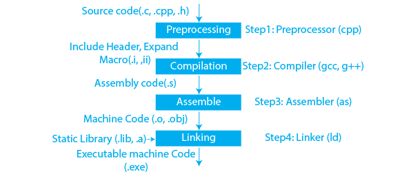

# C++ Course

<https://www.udemy.com/course/der-komplettkurs-zur-modernen-c-programmierung/learn/lecture/11702546#questions/18657802>
<https://github.com/franneck94/UdemyCpp>

## Prerequisites

- Install C++ Compiler
  - gcc g++
  - gdb (version 9.4.2 ?)
  - make

```shell
# install

sudo apt-get update
sudo apt-get upgrade
 
sudo apt-get install make
sudo apt-get install gdb
sudo apt-get install gcc
sudo apt-get install g++
sudo apt-get install git
sudo apt-get install cmake

# check
gdb --version
gcc --version
g++ --version
```

- VS Code
  - Install C / C++ package (MS)
  - Install C++ config package
  - `ctrl + shift + P` --> C/C++ Config: Generate C++ Config FIles
- Formatter - Clang-Format:
  - [doc](https://clang.llvm.org/docs/ClangFormat.html)
- Linter - Clang-Tidy:
  - [doc](https://clang.llvm.org/extra/clang-tidy/)
  - [video](https://www.udemy.com/course/der-komplettkurs-zur-modernen-c-programmierung/learn/lecture/29779776#questions/18657802)

## Run and Debug

- use CLI
  - `g++ TernaryOperator.cc -g -o main` ... -g for debugging
  - `g++ 08StructuredBinding.cc -g -std=c++20 -o main`  ...-std=xxx for specific c++ compiler
  - `g++ filecc -g -std=c++20 -o main`
  - `./main`
  - `g++ Game.cc  Main.cc -g -o main` ...if various cpp files (ignore headers)
- Use makefile:
  - `make build` and `make run`, afterwards `make clean`
- For debugging
  - make sure `-g` **flag** is set in makefile!
  - Select file and click **(gdb) Launch** in the Debug Window
- Debugging ARGV:
  - <https://www.udemy.com/course/der-komplettkurs-zur-modernen-c-programmierung/learn/lecture/29370936#announcements>

----

- Run with plugin
  - ctrl + shift + B --> Cpp: Debug (Single File) / (Folder)
  - ctrl + shift + B --> Execute: Debug Programm
- Run alternative:
  - ctrl + shift + B --> Cpp: Debug (Single File)
  - C:\Users\HAL9000\source\repos\udemy_vscode>cd 1_Intro
  - C:\Users\HAL9000\source\repos\udemy_vscode\1_Intro>mainDebug.exe

## Cleanup

user scripts:

- `.\cleanup.ps1`
- `.\cleanup.sh`

## Todo

- Edit Make file for single output folder and clean-up before each build (auto delete executables)!

# Content

- Chapter1: Intro
- Chapter2:
  - Variables / const, static
  - Loops & Conditions
  - Tooling
- Chapter3:  
  - Arrays (c-style)  -> c++-style: std::string, std::vector, std::array
  - Pointers
- Chapter4:
  - Enum
  - Struct
  - namespaces

## Compiler / Assembler

[Debug vs Release Mode](https://www.udemy.com/course/der-komplettkurs-zur-modernen-c-programmierung/learn/lecture/21945536#questions/18657802)  
[Assembler explorer](https://godbolt.org/)  
[How the compiler works](https://www.toptal.com/c-plus-plus/c-plus-plus-understanding-compilation)  

- Translation Unit == .cpp + .hpp file
- Include Guard ...to only include functions once
  - `#pragma once`

## Chapter02

### General

- variable initialization .e.g. `constexpr static auto num_rows = std::uint32_t{3};`
  - char a = '\0'; ...Assignment initialization
  - char b('\0'); ...Parentheses initialization
  - char c{'\0'}; ...Brace initialization (uniform, consistent, and safer initialization that prevents narrowing conversions)
  - short c{1.5}; ...Error: narrowing conversion detected
- data types
  - int
  - std::int32_t ...When you need a precise and guaranteed integer size. For cross-platform consistency in data structures, file formats, or network protocols
- `Uniform Initialization` e.g.: `auto var = int{2}` [link](https://ianyepan.github.io/posts/cpp-uniform-initialization/)
- **const** (run-time), **constexpr** (compile-time), **#define** (preprocessor-command), **static** ()
  - const ...Ensures immutability of a variable after initialization
  - static ...Varies by context: retains value in functions, shares across class instances, restricts scope to the file.
  - `#define` vs `const` [link](https://www.geeksforgeeks.org/diffference-define-const-c/)
- type casting e.g. `static_cast<float>(var)` vs `int(a)` vs `float{var}`
- `template <typename T>` ...generics like c# or java

### Loops

- `continue` vs `break`
  - continue ...starts next loop
  - break ...end loop completely
- `for` vs `while`
  - for ...we "know" how often loop will run (x-times)
  - while ...for more complex break-conditions (loop can run 1 or 9999 times)

## Chapter03

### Arrays

- C-style arrays point to memory address (first byte) of array
- C-style arrays have const length! (always provide array length to functions)
- Better us C++ style! `std::array<type>`

### Stack / Heap

Memory management important because no garbage collector in C++

- [Section 8 - Video 64](https://www.udemy.com/course/der-komplettkurs-zur-modernen-c-programmierung/learn/lecture/9363462#announcements)
- **Stack**
  - small (8MB default)
  - fast
  - automatic allocation/deallocation
  - array size must be known to compile time (e.g. array)
- **Heap**
  - big
  - manuall (de)allocation (New and Delete)
  - later: smart pointer

### Pointers and c-style Arrays

- **Pointer**
  - pointer are on the STACK
  - pointer can point to any memory (HEAP, STACK,...)
- **Pointer-Array**
  - to allocate HEAP and have pointer to first addres
  - int *a = new int[10]{1, 2, 3};
- **Call-By-Reference** vs **Call-By-Value** with differenct cases:
  - Input only (`const int v`)
  - Input only with ref (`const int &v`)  // const, but i dont want to create a copy
  - Output only (???)
  - Input & Output (call-by-ref and NO const: `int &v`)

## Conventions

- <https://google.github.io/styleguide/cppguide.html#Variable_Names>

# Compilation Basics

## Hierarchy of the Build Process

[cpp-compilation-process](https://www.prepbytes.com/blog/cpp-programming/cpp-compilation-process/)



- **Preprocessing**
  - All preprocessing directives are handled, including file inclusions, macro expansions, and conditional compilation.
  - `g++ -E main.cpp -o main.i`
- **Compilation**
  - The preprocessed code is compiled into assembly language specific to the target architecture.
  - `g++ -S main.i -o main.s`
- **Assembly**
  - The assembler converts the assembly code into machine code and produces an object file.
  - `g++ -c main.s -o main.o`
- **Linking**
  - The linker takes one or more object files and combines them into a single executable file. It resolves symbols and addresses to ensure that function calls and variable accesses are correctly linked.
  - `g++ main.o -o main`

## Detailes

- **The Preprocessor** By using the preprocessor, it can include additional files in the project without worrying about the C++ translation of the syntax. It operates on a single source file at a time, replacing #include directives with their contents replacing macro define statements with ifdef/endif clauses, and making choices based on the "#if" command. After all of this, the preprocessor generates a single output, a stream of tokens resulting from the alterations mentioned. Also, it contains a few special markers that identify each line’s production location so the compiler can provide helpful error messages. Using #if and #error directives wisely can cause some issues to appear.

- **Compilation** The output of the preprocessor is compiled during the assembly phase. The compiler turns assembly language into pure C++ source code, which it then parses and builds. The underlying back-end is then called, compiling the code into machine language and creating a genuine binary file in some format. The syntax for the symbols defined in the input is contained in this file. In object files, symbols are referred to by name. Object files can make references to symbols that aren’t specified. This is the case when you use a declaration without giving it a definition. Given that we are defining an array inside another, this is an excellent illustration of when the cast was required. As long as the source code is valid, the Cpp compiler doesn’t care about this and will gladly create the object file. At this point, most compilers let you terminate the compilation process. This is highly useful because it enables you to separately compile each source code file. The advantage of this is that if only one file is modified, you don’t have to recompile everything.

- **Assembler** Source code is transformed into object code by the assembler. On a UNIX system, you can notice files with the .o extension, which stand for object code files (.OBJ on MSDOS). The object files are processed by the assembler, which transforms their assembly code into machine language instructions. A relocatable object code is a file that is created. As a result, the compilation procedure creates an object code that is relocatable and may be utilized in other locations without the need for additional compilation.

- **Linking** The code known as the linker converts the object files produced by the compiler into a finished compilation output. This finished product could either be an executable or a shared library, which shares names with static libraries. By substituting the references to the missing symbols with their proper addresses, it resolves symbols that haven’t been declared in any file. Other object files or libraries may declare these symbols. You must inform the compiler about them if they are defined in modules other than the primary ones. At this phase, missing definitions or repeated definitions are the most frequent mistakes. The first suggests that the words are not present (such that, there were not written), but the second suggests that the same symbols were defined twice in two different object files and libraries.

- **Conclusion** The compilation process in C++ is a multifaceted journey that translates human-readable code into machine-executable instructions. From preprocessing and compilation to assembly and linking, each stage contributes to the creation of a final executable file. Mastering the nuances of this process empowers developers to write optimized, error-free code, understand complex debugging scenarios, and comprehend the inner workings of their applications. Continual exploration and comprehension of the compilation process remain pivotal for C++ programmers aiming to enhance their software development skills.

- **.s Files (Assembly Source Files)**
  - Content: These files contain assembly language code, which is a low-level programming language that is specific to a computer architecture.
  - Generation: Typically produced by compilers as an intermediate step when converting higher-level languages like C or C++ into machine code.
  - Usage: Can be manually written or generated to understand or optimize the assembly code that the compiler produces.

- **.o Files (Object Files)**
  - Content: These files contain machine code generated by the compiler, but they are not yet linked into a complete program.
  - Generation: Created when a source file (.c, .cpp, or .s) is compiled. Each source file usually results in one corresponding object file.
  - Usage: Used by the linker to combine with other object files and libraries to produce the final executable.

- **Executable Files**
  - Content: These files contain fully linked and ready-to-run machine code that the operating system can execute.
  - Generation: Created by the linker, which combines object files and resolves all symbols (functions, variables, etc.) into a single program.
  - Usage: Executable files are run directly by the operating system. On Unix-like systems, these typically have no extension but may sometimes end with .out or .bin. On Windows, they typically end with .exe.
